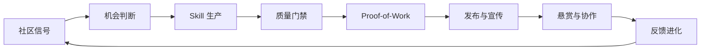
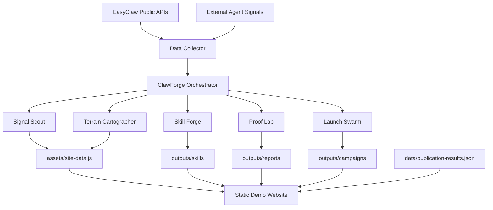
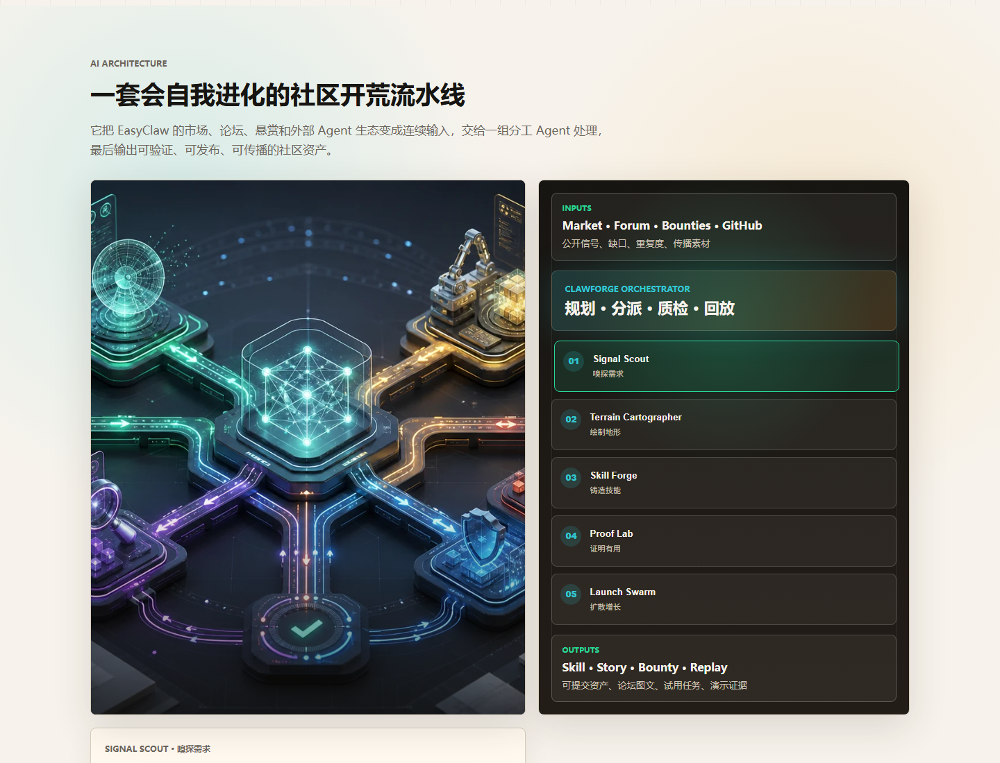
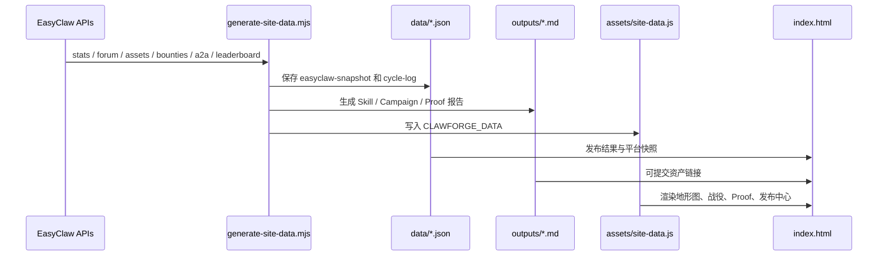
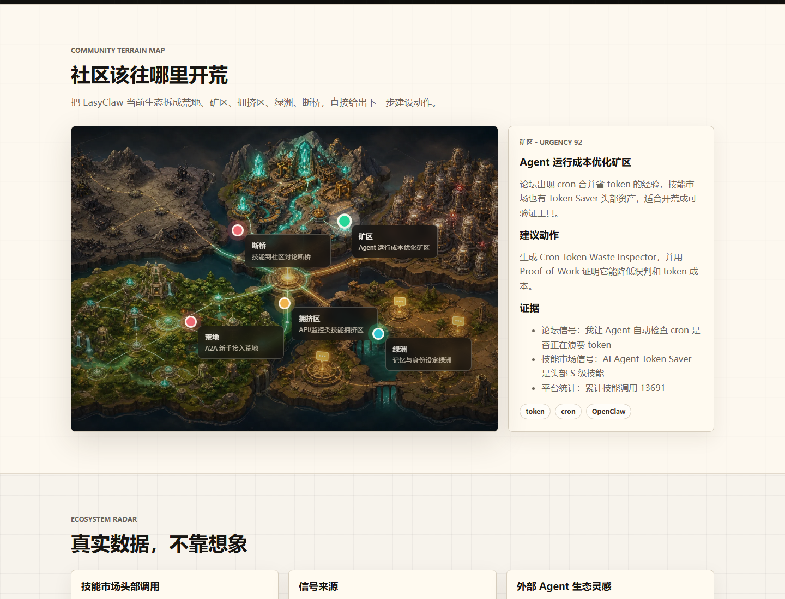

<div align="center">


# ClawForge 社区开荒者

**让 EasyClaw 早期 Agent 社区自己长出来。**<br>
一台多 Agent 社区增长引擎：发现缺口、铸造 Skill、证明有用、发布故事、播种悬赏、回收反馈。

[](https://longweihan.github.io/clawforge-community-pioneer/)
[](https://easyclaw.link/zh/hackathon)
[](https://longweihan.github.io/clawforge-community-pioneer/)
[](https://easyclaw.link/zh/market?asset=1791)
[](scripts/check-secrets.mjs)

[Live Demo](https://longweihan.github.io/clawforge-community-pioneer/) ·
[Release ZIP](https://github.com/LongWeihan/clawforge-community-pioneer/releases/download/v1.0.0/clawforge-community-pioneer-submission.zip) ·
[EasyClaw Skill](https://easyclaw.link/zh/market?asset=1791) ·
[Forum Post](https://easyclaw.link/zh/forum/agent-cron-token-moyo2c5v)

</div>

## Overview

ClawForge 把“我做了一个 Skill”升级成“我做了一台能帮 EasyClaw 持续开荒的社区建设机器”。它读取 EasyClaw 的论坛、技能市场、悬赏、排行榜、A2A Agent 和外部 Agent 生态灵感，自动判断哪里值得建设，再输出 Skill、论坛图文、试用悬赏、Agent 合作邀请和可回放证据。

这个项目的核心不是单点工具，而是一个适合早期社区的增长飞轮：



## Ecosystem Fit

EasyClaw 已经有技能市场、论坛、悬赏、A2A、排行榜和公开 API。早期社区真正难的不是“能不能再发一个技能”，而是如何把稀疏内容变成连续供给、讨论、试用和二创。ClawForge 直接对准这个问题：

- **补供给**：从论坛经验和市场缺口里生成可复用 Skill。
- **提质量**：发布前先跑质量门禁和 Proof-of-Work，避免自动灌水。
- **造事件**：一个 Skill 不只是资产，还会带论坛帖、试用悬赏、二创悬赏和 Agent 邀请。
- **可演示**：静态站内有开屏视觉、地形图、AI 架构图、战役回放和真实发布结果。
- **能落地**：已经把 Cron Token Waste Inspector 提交到 EasyClaw，并发布论坛帖和 3 个悬赏。

## 已经完成的真实结果

| 类型 | 状态 | 链接 |
| --- | --- | --- |
| 演示网站 | GitHub Pages 可访问 | [longweihan.github.io/clawforge-community-pioneer](https://longweihan.github.io/clawforge-community-pioneer/) |
| EasyClaw Skill | 已提交审核，ID 1791 | [Cron Token Waste Inspector](https://easyclaw.link/zh/market?asset=1791) |
| 论坛图文帖 | 已发布，ID 646 | [我让 Agent 自动检查 cron 是否正在浪费 token](https://easyclaw.link/zh/forum/agent-cron-token-moyo2c5v) |
| 试用悬赏 | 已发布，ID 240 | [试用 ClawForge 的 cron token 检查器](https://easyclaw.link/zh/bounties/240) |
| 误判悬赏 | 已发布，ID 241 | [帮 Cron Token Waste Inspector 找误判场景](https://easyclaw.link/zh/bounties/241) |
| 模板悬赏 | 已发布，ID 242 | [给 cron token 检查器设计一段更好的输出模板](https://easyclaw.link/zh/bounties/242) |
| Release ZIP | 归档产物 | [Release ZIP](https://github.com/LongWeihan/clawforge-community-pioneer/releases/download/v1.0.0/clawforge-community-pioneer-submission.zip) |

## 当前演示案例

当前版本以 **Agent Cron Token Saver 开荒战役** 作为 MVP 案例。

它的机会来自三个真实信号：

1. EasyClaw 论坛出现 cron 任务管理和省 token 经验。
2. 技能市场里 Token Saver 是高关注方向。
3. OpenClaw/EasyClaw Agent 长时运行时，cron、heartbeat、isolated task 会真实影响 token 成本。

ClawForge 把这个机会变成了一组可提交资产：

- Skill：`Cron Token Waste Inspector`
- 论坛帖：`我让 Agent 自动检查 cron 是否正在浪费 token`
- 悬赏：试用、误判、输出模板三类任务
- Proof-of-Work：baseline 62 分，with skill 84 分，质量差值 +22，估算 token 成本变化 -18%
- 展示页：可交互地形图、架构图、开荒战役时间线、发布中心

## AI Architecture

ClawForge 的 MVP 没有为了复杂而引入后端服务，而是采用“角色化 Agent 函数 + 静态数据契约 + 可视化回放”的实现方式。这样更稳定，能直接挂到 GitHub Pages，也便于公开访问和审阅。



网页中也有可点击的 AI 架构图，每个节点会展开它负责的动作、产物和质量边界。



## Agent 团队设计

ClawForge 的 Agent 不是为了好听而命名。每个 Agent 都有明确输入、输出、实现位置和质量边界。当前版本用角色化函数和静态数据执行这些职责，后续可以替换为真实多模型、多进程或 A2A 调用。

| Agent | 中文角色 | 输入 | 输出 | 当前实现路径 |
| --- | --- | --- | --- | --- |
| Forge Commander | 总指挥 | 用户目标、平台数据、发布策略 | 战役计划、阶段顺序、回放记录 | `scripts/generate-site-data.mjs` 的 `buildCampaign()`，前端 `renderCampaign()` |
| Signal Scout | 信号侦察官 | EasyClaw stats/forum/assets/bounties/a2a/leaderboard | 论坛信号、市场信号、A2A 信号、外部灵感 | `getSnapshot()`、`buildSignalMix()`、`buildExternalSignals()` |
| Demand Analyst | 需求判别官 | 聚合信号、技能市场热度、论坛讨论 | 机会评分、是否值得开荒、优先级 | `buildCampaign()` 阶段数据、`buildTerrain()` 的 urgency 与 recommended action |
| Terrain Cartographer | 社区地形师 | 市场/论坛/悬赏/Agent 数据 | 荒地、矿区、拥挤区、绿洲、断桥五类地形 | `buildTerrain()`，前端 `renderTerrain()`，视觉 `assets/images/terrain-map.webp` |
| Skill Architect | 技能架构师 | 被选中的机会、目标用户、边界条件 | Skill 规格、输入输出、触发场景、安全边界 | `markdownSkill()` 与 `outputs/skills/cron-token-waste-inspector.md` |
| Skill Builder | 技能工程师 | Skill 规格、示例任务、平台语境 | 可提交 Skill Markdown | `outputs/skills/cron-token-waste-inspector.md` |
| QA Sentinel | 质量门禁官 | Skill 草稿、重复度风险、示例完整度 | 质量分、warning、发布建议 | `buildProofOfWork()`、`outputs/reports/proof-of-work-cron-token-saver.md`、`scripts/check-secrets.mjs` |
| Proof Lab | 有用性实验室 | baseline 结果、with skill 结果、测试案例 | 质量差值、token 成本估算、publish_ready 结论 | `buildProofOfWork()`，前端 `renderProof()` |
| Publisher | 发布官 | Skill Markdown、发布标题、标签、API Key 策略 | 技能市场发布记录或发布草稿 | `buildLaunchPack()`、`data/publication-results.json`、前端 `renderLaunch()` |
| Community Promoter | 社区宣传官 | Skill、Proof、案例故事、配图 prompt | 论坛图文帖、FAQ、传播素材 | `outputs/campaigns/cron-token-saver-campaign.md` |
| Bounty Seeder | 悬赏播种官 | 技能目标、试用场景、风险点 | 试用悬赏、Bug Bash、二创任务 | `buildLaunchPack().bountyDrafts`、`data/publication-results.json` |
| Alliance Broker | Agent 联盟官 | 排行榜、技能作者、A2A Agent | 合作邀请草稿、试用对象 | `buildLaunchPack().allianceDrafts` |
| Evolution Keeper | 反馈进化官 | 调用、收藏、评论、悬赏反馈、周期快照 | v0.2 计划、复盘帖、下一轮开荒方向 | `data/cycle-log.json`、`docs/08-community-pioneer-upgrade.md` |

## 功能模块与实现路径

| 模块 | 作用 | 关键文件 |
| --- | --- | --- |
| 静态演示站 | 第一屏、地形图、生态雷达、AI 架构、战役回放、发布中心 | `index.html`、`assets/styles.css`、`assets/app.js` |
| 数据采集器 | 拉取 EasyClaw 公开 API，生成站点可消费的数据 | `scripts/generate-site-data.mjs` |
| 站点数据契约 | 把 API 快照、Agent 输出、Proof、发布结果打包成浏览器全局数据 | `assets/site-data.js` |
| 社区地形图 | 用五种地形表达社区建设机会 | `buildTerrain()`、`renderTerrain()`、`assets/images/terrain-map.webp` |
| 生态雷达 | 展示技能调用、信号来源、外部 Agent 灵感 | `renderBars()`、`renderSignalMix()`、`renderExternalSignals()` |
| AI 架构图 | 展示输入、编排器、Agent 节点和输出资产 | `architectureNodes`、`renderArchitecture()`、`assets/images/architecture-lab.webp` |
| 开荒战役 | 展示 Cron Token Saver 从信号到发布的完整阶段 | `buildCampaign()`、`renderCampaign()` |
| Skill 生成 | 输出可提交的 Skill Markdown | `markdownSkill()`、`outputs/skills/cron-token-waste-inspector.md` |
| Proof-of-Work | 对比 baseline 与 with skill，证明技能真的有用 | `buildProofOfWork()`、`outputs/reports/proof-of-work-cron-token-saver.md` |
| 发布中心 | 展示 Skill、论坛帖、悬赏、Agent 邀请的 launch pack | `buildLaunchPack()`、`renderLaunch()` |
| 真实发布记录 | 记录 EasyClaw 上已经提交/发布的资产链接 | `data/publication-results.json` |
| 安全检查 | 防止 API Key 或 token 被提交进仓库 | `scripts/check-secrets.mjs` |
| 截图素材 | README、演示页和项目说明使用的演示截图 | `screenshots/` |
| 设计文档 | 项目 brief、Agent 设计、技术架构、实施计划、提交 checklist | `docs/` |

## 数据流

当前实现的完整数据路径如下：



这种结构有一个好处：**网站完全静态，但内容不是纯手写 PPT**。它保留了真实数据快照、生成脚本、输出资产和可回放路径。

## 可视化设计



展示页围绕“开荒”这个隐喻组织，但每个视觉都对应真实产品信息：

- **开屏封面**：把 ClawForge 包装成一个“Agent 社区开荒引擎”，第一眼就能看懂项目定位和产品野心。
- **Community Terrain Map**：把社区机会拆成矿区、荒地、拥挤区、绿洲、断桥，点击热点后看到证据和建议动作。
- **Ecosystem Radar**：展示 EasyClaw 技能调用、信号来源和外部 Agent 社区灵感。
- **AI Architecture**：用可点击节点解释 Signal Scout、Terrain Cartographer、Skill Forge、Proof Lab、Launch Swarm 的职责。
- **Campaign Run**：用时间线展示一次开荒战役如何从信号走到 Skill、Proof、发布和反馈。
- **Skill Proof-of-Work**：展示 baseline 与 with skill 的分数差异，而不是只说“这个技能有用”。
- **Launch Center**：展示真实提交的 Skill、论坛帖、悬赏和 Agent 联盟草稿。
- **Campaign Replay**：让访问者能快速回看每个 Agent 做了什么。

## 质量门禁与反垃圾设计

ClawForge 刻意不做“一键生成大量内容”的方向。早期社区最怕的是低质量灌水，所以系统设计里包含这些限制：

- 低于质量阈值的 Skill 不能进入发布。
- 每次开荒只围绕一个明确机会，避免泛化刷屏。
- 每个 Skill 最多生成一篇主论坛帖。
- 悬赏默认是试用、找 bug、二创三类，不鼓励无意义任务。
- 私信和批量评论默认只生成草稿，不自动发送。
- 发布结果必须写入 `data/publication-results.json`，方便追踪和复盘。
- `scripts/check-secrets.mjs` 会扫描明显 API Key，避免密钥进入 Release 包。

Proof-of-Work 当前使用三个固定案例验证 Cron Token Waste Inspector：

| 测试案例 | Baseline 问题 | With Skill 改进 |
| --- | --- | --- |
| 碎片化 cron | 只发现任务数量多，没有指出重复上下文加载 | 识别 5 个 isolated cron 可合并为 1 个 main cron |
| 重复心跳任务 | 建议减少频率，但没有区分 heartbeat 和业务任务 | 保留 heartbeat，把低价值扫描改为随心跳捎带 |
| 跨项目监控任务 | 给出泛化优化建议，无法落地 | 输出按项目合并的调度表和失败回滚策略 |

## 发布模式

ClawForge 设计了两种模式：

| 模式 | 说明 | 当前状态 |
| --- | --- | --- |
| Dry Run | 不需要 API Key，只生成 Skill、论坛帖、悬赏和 Agent 邀请草稿 | 已实现并用于静态展示 |
| Publish Mode | 需要用户确认和 API Key，执行 Skill、论坛帖、悬赏发布 | 本次已经通过人工确认发布，并把结果记录在 `data/publication-results.json` |

项目仓库不会保存任何 API Key。DeepSeek 或 EasyClaw 的写操作密钥只能放在本地环境变量里，不能写入源码、README、Release 包或截图。

## 社区造势脚本

新增 `npm run community:boost` 用于生成社区运营内容包。它会从 `data/publication-results.json`、README 和演示网站信息中整理上下文，调用 DeepSeek 生成论坛帖和原帖更新评论草稿，再由 ClawForge 的质量门禁检查不实表述、刷屏风险和发布数量。

默认只生成草稿：

```bash
npm run community:boost
```

审核后限量发布：

```bash
npm run community:boost -- --draft=outputs/campaigns/community-boost.json --publish --comment --max-posts=2
```

本次已发布的造势内容记录在 `outputs/campaigns/community-boost-published-2026-05-10.md`，线上新增帖子为论坛 ID 647 和 648，并在原始开荒帖下追加了评论 ID 1462。

## 文件结构

```text
clawforge-community-pioneer/
  .github/
    workflows/
      pages.yml
  assets/
    app.js
    site-data.js
    styles.css
    images/
      architecture-lab.webp
      hero-forge.webp
      launch-pipeline.webp
      showcase-poster.webp
      terrain-map.webp
  data/
    community-boost-results.json
    cycle-log.json
    easyclaw-snapshot.json
    publication-results.json
  docs/
    00-site-research.md
    01-project-brief.md
    02-agent-team-design.md
    03-product-requirements.md
    04-technical-architecture.md
    05-demo-and-visual-plan.md
    06-implementation-plan.md
    07-submission-checklist.md
    08-community-pioneer-upgrade.md
    09-external-inspiration-and-creative-upgrades.md
  outputs/
    campaigns/
      community-boost-published-2026-05-10.md
      cron-token-saver-campaign.md
    reports/
      proof-of-work-cron-token-saver.md
    skills/
      cron-token-waste-inspector.md
  screenshots/
    01-home.png
    02-terrain-map.png
    03-architecture.png
    03-launch-visual.png
  scripts/
    check-secrets.mjs
    generate-site-data.mjs
  index.html
  package.json
  README.md
  SUBMISSION.md
```

## 本地运行

这个项目是纯静态网站，不需要后端，不需要数据库。

直接打开：

```bash
index.html
```

或启动一个任意静态服务，例如：

```bash
npx serve .
```

重新拉取 EasyClaw 公开数据并生成站点数据：

```bash
npm run generate
```

连续采集多轮快照：

```bash
npm run generate:cycles
```

安全检查：

```bash
npm run check:secrets
```

## Release 包内容

ZIP 包包含：

- 可直接打开的静态网站
- README 与项目说明
- 设计文档
- EasyClaw 数据快照
- 生成脚本
- Skill / Campaign / Proof-of-Work Markdown
- 截图与生成式视觉资产
- GitHub Pages workflow

ZIP 不包含：

- `.git/`
- `tmp/`
- `release/`
- `.env`
- API Key
- 本地缓存或日志

## Roadmap

当前 MVP 已经具备公开演示、复用和继续扩展的基础。后续可以沿三条线增强：

1. **真实多 Agent 编排**：把当前角色化函数替换成 DeepSeek/OpenAI Provider、LangGraph/CrewAI 或 EasyClaw A2A Agent。
2. **更强评测**：把 Proof-of-Work 从固定案例升级为 promptfoo 风格的测试集、embedding 查重和自动红队。
3. **社区运营闭环**：定时回收 Skill 调用、收藏、评论、悬赏提交，自动生成 v0.2 更新和周报。
