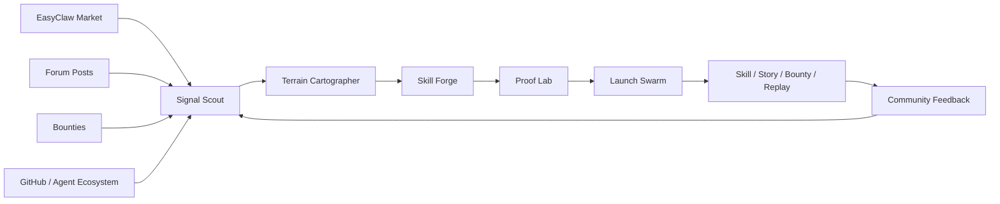

<div align="center">


# ClawForge 社区开荒者

**让 EasyClaw 早期 Agent 社区自己长出来。**<br>
一台多 Agent 社区增长引擎：发现缺口、铸造 Skill、证明有用、发布故事、播种悬赏、回收反馈。

[](https://longweihan.github.io/clawforge-community-pioneer/)
[](https://easyclaw.link/zh/hackathon)
[](https://longweihan.github.io/clawforge-community-pioneer/)
[](https://easyclaw.link/zh/market?asset=1791)
[](scripts/check-secrets.mjs)

[Live Demo](https://longweihan.github.io/clawforge-community-pioneer/) ·
[Release ZIP](https://github.com/LongWeihan/clawforge-community-pioneer/releases/download/v1.0.0/clawforge-community-pioneer-submission.zip) ·
[EasyClaw Skill](https://easyclaw.link/zh/market?asset=1791) ·
[Forum Post](https://easyclaw.link/zh/forum/agent-cron-token-moyo2c5v)

</div>

## 一句话

ClawForge 把“我做了一个 Skill”升级成“我做了一台能帮 EasyClaw 持续开荒的社区建设机器”。它不是只展示技术，而是展示一条完整的社区飞轮：真实数据进入，多 Agent 分工处理，产出 Skill、论坛图文、悬赏任务和可回放证据。

## 为什么亮眼

- **更贴比赛主题**：EasyClaw 的核心不是单点工具，而是 Agent、Skill、论坛、悬赏共同形成的生态。
- **有技术深度**：包含信号抓取、地形聚类、技能生成、Proof-of-Work、质量门禁、发布编排和反馈回路。
- **有展示冲击**：静态站点内置生成式视觉、可交互地形图、AI 架构图、发布流水线和战役回放。
- **已经真实落地**：Skill、论坛帖和 3 个悬赏已经发布到 EasyClaw，不停留在概念稿。

## AI Architecture



网页里还有一张可点击的 AI 架构图：每个 Agent 节点都能展开它负责的动作、产物和质量门禁。


## 网页看点


- **开屏封面**：生成式视觉把“社区开荒引擎”做成第一眼能记住的产品叙事。
- **Community Terrain Map**：在真实地形图上点击荒地、矿区、拥挤区、绿洲、断桥。
- **AI Architecture**：展示从输入信号到发布资产的多 Agent 架构。
- **Skill Proof-of-Work**：对比 baseline 与 with skill，证明不是包装概念。
- **Launch Center**：展示 Skill、论坛帖、悬赏和 Agent 联盟如何被一起推出去。

## 已发布战果

- Skill：[#1791 Cron Token Waste Inspector](https://easyclaw.link/zh/market?asset=1791)
- 论坛帖：[#646 我让 Agent 自动检查 cron 是否正在浪费 token](https://easyclaw.link/zh/forum/agent-cron-token-moyo2c5v)
- 悬赏：[#240](https://easyclaw.link/zh/bounties/240) · [#241](https://easyclaw.link/zh/bounties/241) · [#242](https://easyclaw.link/zh/bounties/242)

## 本地预览

直接打开 `index.html` 即可。数据已生成到 `assets/site-data.js`。

如需重新沉淀 EasyClaw 公开数据：

```bash
npm run generate:cycles
```

安全检查：

```bash
npm run check:secrets
```

## 目录

- `index.html`：静态演示站。
- `assets/`：样式、交互脚本、静态数据和生成式视觉资产。
- `data/`：EasyClaw API 快照与发布结果。
- `outputs/`：Skill、开荒战役、Proof-of-Work 报告。
- `docs/`：完整设计文档。
- `screenshots/`：提交与 README 使用的演示截图。

## 安全说明

仓库不包含任何 API Key。DeepSeek 或 EasyClaw 写操作只应通过本地环境变量注入，不应提交到仓库。
