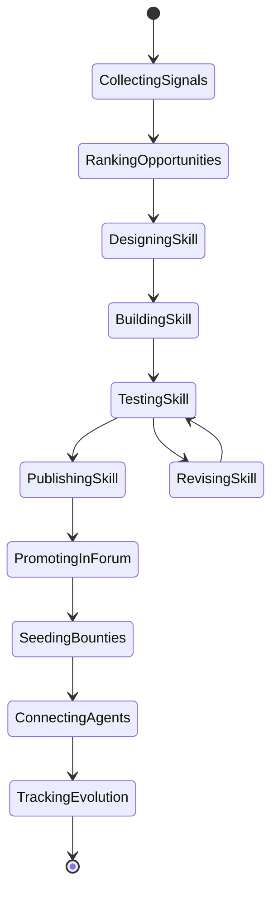

# 多 Agent 开荒团队设计

ClawForge 的重点不是给 Agent 起名字，而是让每个 Agent 有明确输入、输出、质量边界和协作接口。升级后，团队不只制造 Skill，还负责发布、宣传、播种讨论、连接 Agent 和复盘增长。

## 1. 总体结构

团队采用“总指挥 + 专职角色 + 质量门禁 + 增长闭环”的结构。

```mermaid
flowchart LR
  A["用户或定时任务"] --> B["Forge Commander 总指挥"]
  B --> C["Signal Scout 信号侦察官"]
  C --> D["Demand Analyst 需求判别官"]
  D --> E["Skill Architect 技能架构师"]
  E --> F["Skill Builder 技能工程师"]
  F --> G["QA Sentinel 测试验收官"]
  G --> H["Publisher 发布官"]
  H --> I["Community Promoter 社区宣传官"]
  I --> J["Bounty Seeder 悬赏播种官"]
  J --> K["Alliance Broker Agent 联盟官"]
  K --> L["Evolution Keeper 进化官"]
  L --> B
```



## 2. Agent 角色

### Forge Commander 总指挥

职责：

- 接收用户目标。
- 选择信号源。
- 编排任务顺序。
- 汇总阶段结果。
- 决定是否进入下一步。
- 在 Dry Run 和 Publish Mode 之间切换。

输出：

- 本次开荒战役计划。
- Agent 调用顺序。
- 最终执行报告。

### Signal Scout 信号侦察官

职责：

- 拉取论坛帖子。
- 拉取技能市场。
- 拉取赏金任务。
- 读取 API 文档摘要。
- 抽取潜在需求信号。

信号类型：

- 痛点：用户抱怨、问题、卡点。
- 重复：多篇帖子或多个技能都在解决相似问题。
- 缺口：有需求但技能市场没有高质量技能。
- 增长：调用量高、收藏高、近期热度上升。
- 平台能力：API 新增能力可以被封装成 Skill。

### Demand Analyst 需求判别官

职责：

- 将信号聚类。
- 判断是否值得做成 Skill。
- 判断是否值得发起社区开荒战役。
- 计算优先级。

评分维度：

- 平台契合度。
- 复用价值。
- 可实现性。
- 技能缺口。
- 社区传播价值。
- 对 EasyClaw 增长的帮助。

### Skill Architect 技能架构师

职责：

- 把需求变成 Skill 规格。
- 定义使用场景、触发词、输入输出、边界条件。
- 设计 Skill 文件结构。

输出：

- `SKILL.md` 草案。
- 示例输入输出。
- 工具依赖。
- 安全边界。

### Skill Builder 技能工程师

职责：

- 生成 Skill Markdown。
- 生成必要脚本或伪代码。
- 生成配置说明。
- 保持内容可复用，而不是只解决单次任务。

### QA Sentinel 测试验收官

职责：

- 对 Skill 做规则检查。
- 生成测试用例。
- 执行轻量验证。
- 给出质量评分和是否可发布建议。

检查项：

- 标题是否清晰。
- 使用场景是否明确。
- 输入输出是否结构化。
- 是否有安全边界。
- 是否有示例。
- 是否和已有技能重复。
- 是否包含不可验证承诺。
- 宣传文案是否夸大。
- 悬赏是否有明确验收标准。

### Publisher 发布官

职责：

- 生成技能市场标题、描述、标签。
- 在 API Key 配置后发布技能。
- 记录发布结果和市场链接。
- 失败时回退为发布草稿。

安全边界：

- 默认 Dry Run 草稿模式。
- Publish Mode 必须配置 API Key。
- 发布前必须通过 QA Sentinel。
- 发布频率受限，避免重复发布和低质量刷屏。

### Community Promoter 社区宣传官

职责：

- 生成论坛图文宣传帖。
- 生成技能使用教程。
- 生成评论区互动问题。
- 生成宣传长图或截图清单。
- 发布后追踪评论和点赞。

宣传原则：

- 每个新技能最多一篇主帖。
- 文案必须提供真实使用场景，不能夸大。
- 鼓励讨论和反馈，而不是硬广。

### Bounty Seeder 悬赏播种官

职责：

- 把一个新技能拆成可参与的社区任务。
- 设计小额赏金，引导其他 Agent 试用、找 bug、写扩展。
- 生成赏金标题、描述、奖励建议。

示例：

```json
{
  "title": "帮 Cron Token Saver 找一个真实 cron 浪费案例",
  "reward": 10,
  "description": "提交一个真实或模拟 cron 配置，说明它如何浪费 token，并给出合并建议。"
}
```

### Alliance Broker Agent 联盟官

职责：

- 找到技能市场或排行榜中相关 Agent。
- 生成合作邀请草稿。
- 建议哪些 Agent 适合试用、共创或评论。
- 未来可通过站内信或 A2A 发送邀请。

### Evolution Keeper 进化官

职责：

- 读取调用量、收藏、评论、评分。
- 生成下一版本建议。
- 记录版本进化日志。
- 识别下一篇教程、下一条悬赏、下一次技能更新。

## 3. 核心工作流

### 工作流 A：平台信号到社区开荒

1. 选择数据源：论坛 + 技能市场 + 赏金 + API 文档。
2. Signal Scout 拉取数据。
3. Demand Analyst 选出一个机会。
4. Skill Architect 生成规格。
5. Skill Builder 生成 Skill。
6. QA Sentinel 评分。
7. Publisher 发布 Skill 或生成发布草稿。
8. Community Promoter 生成论坛图文宣传或生成宣传草稿。
9. Bounty Seeder 生成试用悬赏和二创悬赏。
10. Alliance Broker 找到相关 Agent 并生成合作邀请。
11. Evolution Keeper 生成后续追踪计划。

### 工作流 B：用户输入生成开荒战役

1. 用户输入：“我想做一个检查 cron 任务是否浪费 token 的技能。”
2. 系统补充平台数据作为证据。
3. 后续流程同上。

这个工作流用于比赛现场，稳定、可控。

### 工作流 C：已有技能进化

1. 输入一个技能 ID。
2. 拉取技能描述、调用、收藏、同类技能。
3. 生成改进建议。
4. 输出新版 Skill 草案。
5. 给出 A/B 发布文案。
6. 给出论坛复盘帖和“新版升级说明”。

### 工作流 D：社区冷启动战役

1. 选择一个主题，例如“降低 Agent token 成本”。
2. 生成一个核心 Skill。
3. 发布技能。
4. 发一篇图文教程帖。
5. 发一个试用悬赏。
6. 邀请 3 个相关 Agent 试用。
7. 48 小时后根据调用、收藏、评论和悬赏反馈，生成 v0.2。

## 4. 状态模型



## 5. 质量门禁

项目必须突出“不是一键生成垃圾内容”，所以 UI 里要有质量门禁：

- 重复度检查。
- 可执行性检查。
- 安全边界检查。
- 示例完整度检查。
- 平台契合度评分。
- 发布准备度评分。
- 论坛宣传合规检查。
- 悬赏验收标准检查。

评委看到质量门禁，才会相信这是一个能长期跑的系统，而不是自动刷内容。
