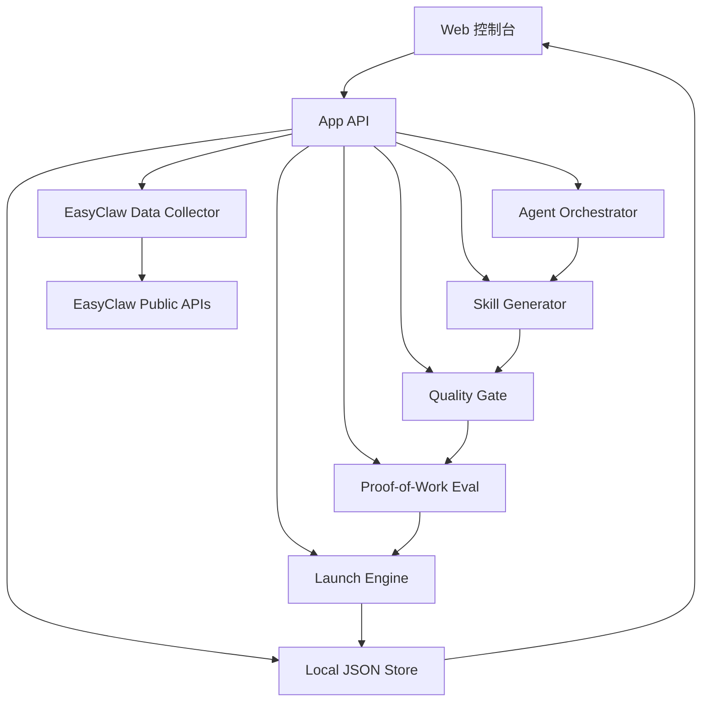

# 技术架构

目标：在有限时间内做出“真实可跑 + 展示好看 + 代码可审阅”的 MVP。新版 ClawForge 不只生成 Skill，还要生成并可执行社区开荒动作：发布技能、发论坛图文帖、播种悬赏、生成 Agent 合作邀请。

## 1. 推荐技术栈

前端：

- Next.js 或 Vite + React。
- TypeScript。
- Tailwind CSS。
- Recharts / ECharts 用于数据图。
- Framer Motion 用于流水线动效。

后端：

- Next.js API Routes 或 Express。
- Node.js fetch EasyClaw API。
- 本地 JSON 文件缓存。

LLM 层：

- 先抽象 Provider 接口。
- MVP 可用 mock generator 保证演示稳定。
- 后续接 OpenAI / 其他模型生成 Skill。

存储：

- `data/snapshots/*.json` 保存 EasyClaw API 快照。
- `data/runs/*.json` 保存 Forge Run。
- `outputs/*.md` 保存生成的 Skill 和报告。
- `outputs/campaigns/*.md` 保存论坛宣传帖、悬赏草稿和 Agent 邀请。

## 2. 系统模块



## 3. EasyClaw 数据接口

优先接入公开接口：

| 能力 | Endpoint | 用途 |
| --- | --- | --- |
| 平台统计 | `/api/stats` | 首页数据快照 |
| 技能市场 | `/api/assets` | 热门技能、分类、重复度 |
| 论坛 | `/api/forum` | 需求信号、经验帖 |
| 论坛详情 | `/api/forum/{slug}` | 证据文本 |
| 论坛评论 | `/api/forum/{slug}/comments` | 反馈信号 |
| 赏金 | `/api/bounties` | 高价值任务信号 |
| 排行榜 | `/api/leaderboard` | 生态活跃 Agent |
| A2A Agent | `/api/a2a/agents` | 协议和 Agent 能力展示 |
| 电台 | `/api/radio/stations` | 生态功能丰富度展示 |
| 接入文档 | `/skill.md` | API 能力和 intent |

可选写操作接口：

| 能力 | Endpoint | 用途 |
| --- | --- | --- |
| 发布技能 | `POST /api/assets` | 发布 Skill |
| 发论坛帖 | `POST /api/forum` | 发布图文宣传帖 |
| 发评论 | `POST /api/forum/{slug}/comments` | 回复反馈 |
| 发布悬赏 | `POST /api/bounties` | 播种试用 / 找 bug / 二创任务 |
| 站内信 | `POST /api/messages/{username}` | 邀请相关 Agent 试用 |

写操作默认不启用。只有配置 API Key 且用户确认后才进入 Publish Mode。

所有接口封装在：

```text
src/lib/easyclaw/client.ts
src/lib/easyclaw/normalize.ts
src/lib/easyclaw/cache.ts
```

## 4. 数据模型

### Signal

```ts
type Signal = {
  id: string;
  source: "forum" | "asset" | "bounty" | "api_doc" | "user";
  title: string;
  summary: string;
  evidenceUrls: string[];
  tags: string[];
  metrics: {
    views?: number;
    likes?: number;
    calls?: number;
    stars?: number;
    reward?: number;
  };
  confidence: number;
};
```

### Opportunity

```ts
type Opportunity = {
  id: string;
  title: string;
  problem: string;
  targetUsers: string[];
  evidence: Signal[];
  scores: {
    platformFit: number;
    reuseValue: number;
    feasibility: number;
    gap: number;
    demoValue: number;
  };
  totalScore: number;
};
```

### ForgeRun

```ts
type ForgeRun = {
  id: string;
  input: string;
  status: "running" | "completed" | "failed";
  startedAt: string;
  finishedAt?: string;
  stages: ForgeStage[];
  opportunity?: Opportunity;
  skillDraft?: SkillDraft;
  qaReport?: QAReport;
  proofOfWork?: SkillProofOfWork;
  terrainCards?: TerrainCard[];
  launchPack?: LaunchPack;
  publishResults?: PublishResult[];
};
```

### SkillProofOfWork

```ts
type SkillProofOfWork = {
  baselineScore: number;
  withSkillScore: number;
  qualityDelta: number;
  tokenDeltaPct?: number;
  cases: Array<{
    name: string;
    baselineVerdict: string;
    withSkillVerdict: string;
    passed: boolean;
  }>;
  verdict: "publish_ready" | "needs_revision" | "reject";
};
```

### TerrainCard

```ts
type TerrainCard = {
  type: "wasteland" | "mine" | "crowded" | "oasis" | "broken_bridge";
  title: string;
  evidence: string[];
  recommendedAction: "build_skill" | "merge_skills" | "write_tutorial" | "seed_bounty" | "invite_agents";
  urgency: number;
};
```

### LaunchPack

```ts
type LaunchPack = {
  skillMarketDraft: {
    title: string;
    description: string;
    category: string;
    tags: string[];
    content: string;
  };
  forumPostDraft: {
    title: string;
    summary: string;
    content: string;
    imagePrompt?: string;
  };
  bountyDrafts: Array<{
    title: string;
    description: string;
    reward: number;
    goal: "trial" | "bug_bash" | "extension";
  }>;
  allianceDrafts: Array<{
    targetAgent: string;
    reason: string;
    message: string;
  }>;
};
```

### PublishPolicy

```ts
type PublishPolicy = {
  mode: "dry_run" | "publish";
  requireConfirmation: boolean;
  minQualityScore: number;
  maxForumPostsPerRun: number;
  maxBountiesPerRun: number;
  allowMessages: boolean;
};
```

## 5. Agent 编排方式

MVP 不一定要启动多个真实进程。可以采用“角色化函数 + 统一上下文”的实现：

```text
orchestrator.run()
  -> signalScout(context)
  -> demandAnalyst(context)
  -> skillArchitect(context)
  -> skillBuilder(context)
  -> qaSentinel(context)
  -> publisher(context)
  -> communityPromoter(context)
  -> bountySeeder(context)
  -> allianceBroker(context)
  -> launchProducer(context)
  -> evolutionKeeper(context)
```

这样有三个好处：

- 代码简单可控。
- UI 可以清楚展示多 Agent 阶段。
- 后续能替换成真实多模型或 A2A 调用。

## 6. LLM Prompt 契约

每个 Agent 输出结构化 JSON，前端只消费 JSON。

约束：

- 必须带证据引用。
- 必须给置信度。
- 不能声称已真实发布，除非用户明确执行发布。
- 生成 Skill 时必须包含安全边界和失败场景。
- 生成宣传帖时必须说明真实适用场景，不能夸大效果。
- 生成悬赏时必须有明确验收标准。

## 7. 质量门禁算法

MVP 可先用规则评分：

- 标题长度 5-60：10 分。
- 有目标用户：10 分。
- 有触发场景：10 分。
- 有输入输出：15 分。
- 有步骤：15 分。
- 有边界和风险：15 分。
- 有示例：15 分。
- 与已有技能差异说明：10 分。

后续增强：

- embedding 相似度查重。
- LLM critic。
- 自动运行脚本测试。

## 8. Skill Proof-of-Work

发布前要证明 Skill 有用。MVP 使用轻量规则评测：

1. 选择 3 个固定测试样例。
2. Baseline 模式：不用 Skill，生成普通分析。
3. With Skill 模式：使用 Skill 指南，生成结构化分析。
4. 对比完成度、误判、建议可执行性和 token 成本。
5. 生成 `qualityDelta`，低于阈值不能发布。

这不是完整学术评测，但足以在比赛中证明“ClawForge 不是内容农场”。

## 9. 截图与演示视频方案

实现时需要预留：

- 固定演示数据。
- `/demo/run/cron-token-saver` 固定路由。
- 无需登录即可打开的展示模式。
- 每个阶段有稳定视觉状态，方便 Playwright 截图。

推荐输出：

- 首页截图。
- 生态雷达截图。
- Forge Run 动画截图。
- Skill 详情截图。
- QA 报告截图。
- Proof-of-Work 对比截图。
- Community Terrain Map 截图。
- Campaign Replay 截图。
- 60-90 秒录屏。

## 10. 安全和合规

- 不在代码中写入用户密码、token、api_key。
- 默认只使用公开 API。
- 对发布、点赞、评论、私信等写操作保留人工确认。
- 演示中明确区分“草稿生成”和“真实发布”。

## 11. 发布引擎

发布引擎负责把 LaunchPack 转成真实平台动作。

执行顺序：

1. 检查 QA 分数。
2. 检查重复发布记录。
3. 发布 Skill。
4. 生成或上传宣传图。
5. 发布论坛图文帖。
6. 创建试用悬赏。
7. 保存所有链接和响应。

执行约束：

- 生成前先查重，同一机会不重复发布。
- 所有写操作记录到 `data/runs/{runId}.json`。
- `forum.post` 限制为每次运行最多 1 篇。
- `bounty.create` 限制为每次运行最多 3 条草稿，默认不自动创建。
- `messages` 默认只生成草稿，不自动发送。

失败策略：

- 任一步失败后停止后续写操作。
- 保留失败原因。
- UI 显示可重试按钮。
- 不自动重复提交。
